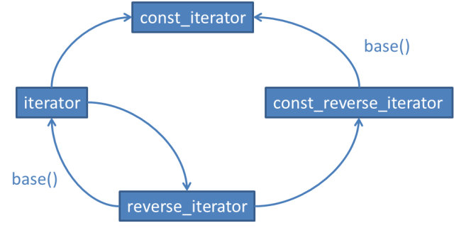

# iterator优先于const_iterator、reverse_iterator以及const_reverse_iterator

对于容器类 `container<T>` 而言，

- `iterator` 的功效相当于 `T*`
- `const_iterator` 的功效相当于 `const T*`
- `reverse_iterator` 与 `const_reverse_iterator` 与前两者类似，只是按照反向遍历

从 `iterator` 到 `const_iterator` 和 `reverse_iterator` 存在隐式转换，从 `reverse_iterator` 到 `const_iterator` 也存在隐式转换。

通过 `base()` 可以将 `reverse_iterator` 转换 `为iterator`，同样可以将 `const_reversse_iterator` 转换为`const_iterator`，但是转换后的结果并不指向同一元素(有一个偏移量)。

