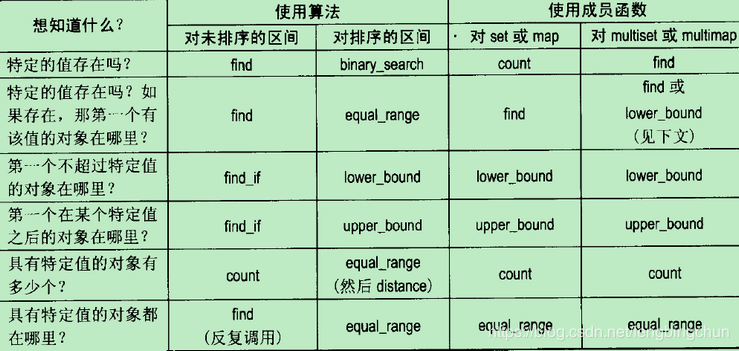

# 正确区分count、find、binary_search、lower_bound、upper_bound和equal_range

在选择具体的查找策略时,由迭代器指定的区间是否是排序的，这是一个至关重要的决定条件。如果区间是排序的，那么通过 `binary_search`、`lower_bound`、`upper_bound` 和 `equal_range`，你可以获得更快的查找速度(通常是对数时间的效率)。如果迭代器并没有指定一个排序的区间，那么你的选择范围将局限于 `count`、`count_if`、`find` 以及 `find_if`，而这些算法仅能提供线性时间的效率。

